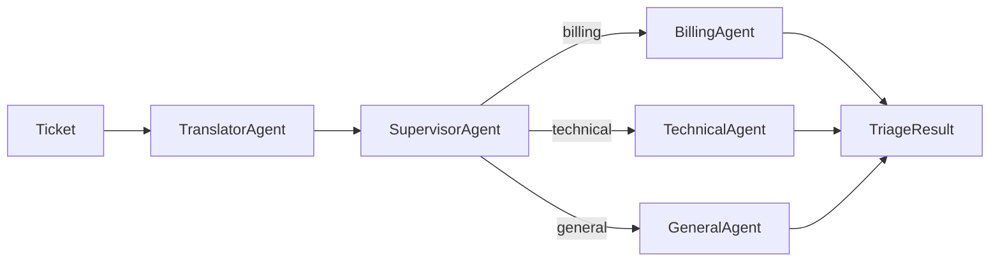

# Support Ticket Triage Agent

AI-powered support ticket triage using LiteLLM, LangGraph, and Qdrant hybrid search.

## Features

- **Urgency Classification**: critical/high/medium/low
- **Information Extraction**: product area, issue type, sentiment, language
- **Knowledge Base Search**: Hybrid search (semantic + BM25)
- **Action Recommendation**: auto-respond, route specialist, escalate

## Tech Stack

- **LiteLLM**: OpenAI-compatible LLM router
- **LangGraph**: Agent workflow orchestration
- **Qdrant**: Vector database with hybrid search
- **FastAPI**: REST API framework
- **Dynaconf**: Configuration management
- **Langfuse**: Observability and prompt management

## Quick Start

### Prerequisites

- Docker & Docker Compose
- Python 3.10+
- OpenAI API key

### Setup

1. Clone and setup environment:

```bash
cp .env.template .env
# Edit .env with your OPENAI_API_KEY

python -m venv .venv
source .venv/bin/activate
pip install -r requirements.txt
```

2. Start services (Qdrant, LiteLLM):

```bash
docker-compose up -d
```

3. Ingest knowledge base:

```bash
python scripts/ingest_kb.py
```

4. Run API:

```bash
uvicorn main:app --reload
```

## API Usage

### Health Check

```bash
curl http://localhost:8000/health
```

### Triage Endpoint

Analyze a support ticket and get triage recommendations.

```bash
curl -X POST http://localhost:8000/api/triage \
  -H "Content-Type: application/json" \
  -d '{
    "customer_id": "customer_001",
    "messages": [
      {
        "role": "customer",
        "content": "I was charged twice for my subscription!"
      }
    ]
  }'
```

### Sample Response

```json
{
  "urgency": "high",
  "extracted_info": {
    "product_area": "billing",
    "issue_type": "double charge",
    "sentiment": "frustrated",
    "language": "en"
  },
  "recommended_action": "escalate_human",
  "suggested_response": null,
  "relevant_articles": [],
  "reasoning": "Billing error with frustrated customer requires human review for refund processing"
}
```

## Architecture

Multi-agent supervisor pattern with Clean Architecture:

```
API → Use Cases (Services) → Domain (Entities, Agents, Workflow) → Repositories → Infrastructure
```



```
src/
├── entities/           # Domain models (Ticket, TriageResult)
├── modules/
│   ├── agents/         # Multi-agent system
│   │   ├── translator/      # Language detection/translation
│   │   ├── supervisor/      # Classification and routing
│   │   └── specialists/     # Billing, Technical, General agents
│   └── graph/          # LangGraph workflow
├── usecases/           # Application business logic
│   └── triage/         # TriageService
├── repositories/       # Data access layer
│   ├── checkpoint/     # Redis checkpoint operations
│   ├── ticket/         # Ticket persistence
│   └── chat/           # Chat message persistence
└── api/                # FastAPI application
    ├── routes/         # API endpoints
    └── dependencies/   # Service initialization
```

See [Architecture Documentation](docs/architecture/README.md) for details.

## Components

| Component | Description | Docs |
|-----------|-------------|------|
| `configs/` | Configuration files | [docs/configs](docs/configs/README.md) |
| `libs/` | Shared libraries | [docs/libs](docs/libs/README.md) |
| `ingestor/` | KB ingestion pipeline | [docs/ingestor](docs/ingestor/README.md) |
| `evaluation/` | LLM-as-Judge evaluation | [docs/evaluation](docs/evaluation/README.md) |
| `src/entities/` | Domain models | [docs/src/entities](docs/src/entities/README.md) |
| `src/modules/` | Agents, graph | [docs/src/modules](docs/src/modules/README.md) |
| `src/usecases/` | Services | [docs/src/usecases](docs/src/usecases/README.md) |
| `src/repositories/` | Data access | [docs/src/repositories](docs/src/repositories/README.md) |
| `src/api/` | FastAPI routes | [docs/api](docs/api/README.md) |

## Documentation

- [API](docs/api/README.md)
- [Architecture](docs/architecture/README.md)
- [Configs](docs/configs/README.md)
- [Libs](docs/libs/README.md)
- [Ingestor](docs/ingestor/README.md)
- [Evaluation](docs/evaluation/README.md)
- [Decisions](docs/decision/README.md)
