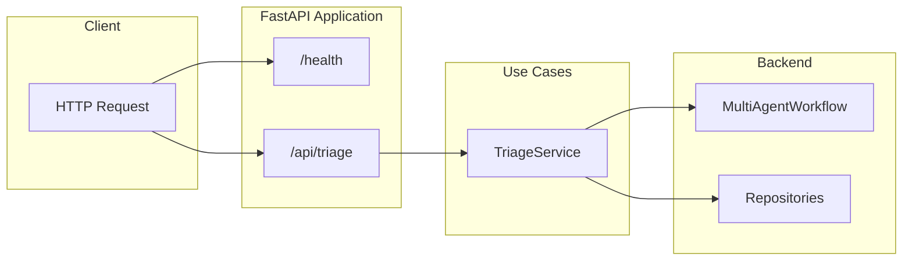

# API

FastAPI REST API for support ticket triage.

## Location

`src/api/`

## Documentation

| Document | Description |
|----------|-------------|
| [triage.md](triage.md) | POST /api/triage - Triage a support ticket |
| [health.md](health.md) | GET /health - Health check endpoint |

## Overview



## Base URL

```
http://localhost:8000
```

## Endpoints Summary

| Endpoint | Method | Description |
|----------|--------|-------------|
| `/health` | GET | Health check |
| `/api/triage` | POST | Triage a support ticket |

## Quick Start

### Health Check

```bash
curl http://localhost:8000/health
```

### Triage Ticket

```bash
curl -X POST http://localhost:8000/api/triage \
  -H "Content-Type: application/json" \
  -d '{
    "customer_id": "customer_001",
    "customer_info": {
      "plan": "enterprise",
      "tenure_months": 24,
      "seats": 45
    },
    "messages": [
      {
        "role": "customer",
        "content": "System is down for 2 hours!"
      }
    ]
  }'
```

## OpenAPI Schema

Interactive API documentation available at:
- Swagger UI: `http://localhost:8000/docs`
- ReDoc: `http://localhost:8000/redoc`

## See Also

- [TriageService](../src/usecases/triage/README.md)
- [Entities](../src/entities/README.md)
- [Workflow](../src/modules/graph/README.md)
- [Evaluation](../evaluation/README.md) - LLM-as-a-Judge evaluation system
