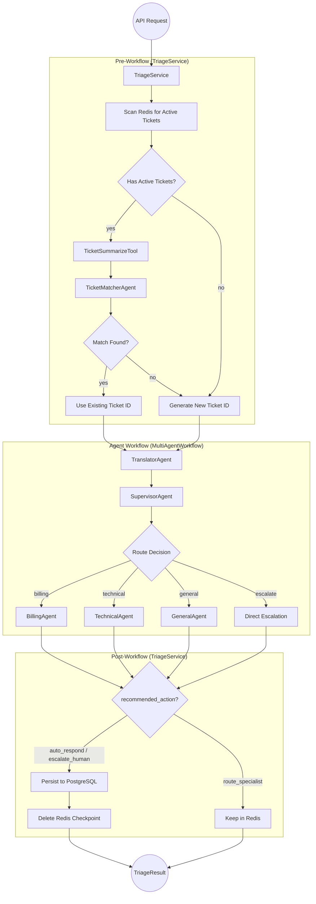
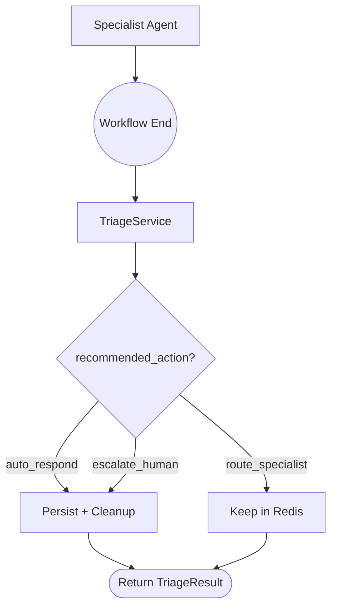
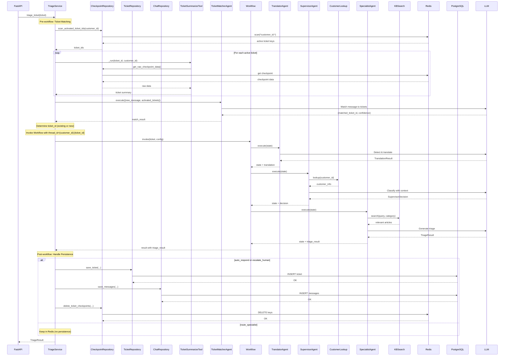

# Agent Flow

Detailed step-by-step execution flow for the multi-agent triage workflow.

## Location

- Workflow: `src/modules/graph/workflow.py`
- Pre/Post Logic: `src/usecases/triage/main.py` (TriageService)

## Overview

The triage flow is split between TriageService (pre/post workflow) and MultiAgentWorkflow (agent execution):



## Step-by-Step Execution

### Pre-Workflow: Ticket Matching (TriageService)

**Purpose**: Determine if the new message relates to an existing active ticket or needs a new ticket.

> **Note**: This step is handled by `TriageService` before invoking the workflow.

| Aspect | Details |
|--------|---------|
| Handler | `TriageService._resolve_ticket_id()` |
| Input | customer_id, new message |
| Tools | TicketSummarizeTool |
| LLM Call | TicketMatcherAgent |
| Output | ticket_id (existing or newly generated) |

**Processing**:
1. `TriageService` calls `CheckpointRepository.scan_activated_ticket_ids(customer_id)`
2. For each active ticket, use `TicketSummarizeTool` to extract summary from checkpoint
3. Call `TicketMatcherAgent` with new message and active ticket summaries
4. If match found (high/medium confidence) → use existing ticket_id
5. If no match → generate new ticket_id (TKT-XXXXXXXX format)

**Thread ID Pattern**:
```
{customer_id}:{ticket_id}
```
Example: `CUST-001:TKT-12345678`

**Redis Key Pattern**:
```
langgraph:checkpoint:{customer_id}:{ticket_id}:*
```

---

### Step 1: TranslatorAgent

**Purpose**: Detect language and translate non-English tickets.

| Aspect | Details |
|--------|---------|
| Input | Original ticket messages |
| Tools | None |
| LLM Call | Language detection + translation |
| Output | `TranslationResult` added to state |

**Processing**:
1. Analyzes all ticket messages
2. Detects the original language
3. If non-English, translates content to English
4. Preserves original messages for response generation

**State Changes**:
```python
state["translation"] = TranslationResult(
    original_language="th",      # Detected language code
    is_english=False,            # Whether ticket is in English
    translated_messages=[...],   # Translated content
    original_messages=[...],     # Original preserved
)
state["current_agent"] = "translator"
```

---

### Step 2: SupervisorAgent

**Purpose**: Classify urgency, determine ticket type, and route to specialist.

| Aspect | Details |
|--------|---------|
| Input | Ticket + translation result |
| Tools | `customer_lookup` |
| LLM Call | Classification with customer context |
| Output | `SupervisorDecision` added to state |

**Processing**:
1. Looks up customer information (plan, tenure, seats, region)
2. Analyzes ticket content with customer context
3. Classifies urgency: `critical` / `high` / `medium` / `low`
4. Determines ticket type: `billing` / `technical` / `general`
5. Decides if direct escalation is needed

**Urgency Classification Logic**:

| Condition | Urgency |
|-----------|---------|
| Enterprise + outage/data loss | CRITICAL |
| Enterprise + billing error | HIGH |
| Pro + service disruption | HIGH |
| Free + general question | LOW |
| Any + security concern | CRITICAL |

**State Changes**:
```python
state["customer_info"] = {
    "plan": "enterprise",
    "tenure_months": 24,
    "seats": 50,
    "region": "us-west",
}
state["supervisor_decision"] = SupervisorDecision(
    urgency=UrgencyLevel.HIGH,
    ticket_type=TicketType.BILLING,
    reasoning="Enterprise customer with billing discrepancy",
    requires_escalation=False,
)
state["current_agent"] = "supervisor"
```

---

### Step 3: Conditional Routing

Based on `supervisor_decision`, the workflow routes to one of four paths:

| Condition | Route To |
|-----------|----------|
| `requires_escalation = true` | `escalate` node |
| `ticket_type = billing` | `BillingAgent` |
| `ticket_type = technical` | `TechnicalAgent` |
| `ticket_type = general` | `GeneralAgent` |

---

### Step 4: Specialist Agent (Billing / Technical / General)

**Purpose**: Domain-specific analysis with knowledge base search.

| Aspect | Details |
|--------|---------|
| Input | Ticket + translation + supervisor decision |
| Tools | `kb_search` (with category filter) |
| LLM Call | Domain analysis + response generation |
| Output | `TriageResult` added to state |

**Processing**:
1. Searches knowledge base for relevant articles (filtered by category)
2. Analyzes issue with domain expertise
3. Determines recommended action
4. Generates suggested response (in original language if translated)
5. Compiles final triage result

**Recommended Actions**:

| Action | When Used |
|--------|-----------|
| `auto_respond` | Simple question with clear KB answer |
| `route_specialist` | Needs human specialist attention |
| `escalate_human` | Complex issue, VIP customer, or sensitive matter |

**State Changes**:
```python
state["kb_results"] = [
    {"id": "kb_002", "title": "Resolving Double Charges", "score": 0.89},
    {"id": "kb_015", "title": "Refund Policy", "score": 0.76},
]
state["triage_result"] = TriageResult(
    urgency=UrgencyLevel.HIGH,
    extracted_info=ExtractedInfo(
        product_area="billing",
        issue_type="refund_request",
        sentiment="frustrated",
        language="en",
    ),
    recommended_action=RecommendedAction.ROUTE_SPECIALIST,
    suggested_response="I understand your concern about...",
    relevant_articles=["kb_002", "kb_015"],
    reasoning="Customer requesting refund for duplicate charge...",
)
state["current_agent"] = "billing"
```

---

### Step 4 (Alternative): Direct Escalation

If `requires_escalation = true`, skips specialist agent entirely:

**State Changes**:
```python
state["triage_result"] = TriageResult(
    urgency=UrgencyLevel.CRITICAL,
    extracted_info=ExtractedInfo(
        product_area="billing",
        issue_type="escalation",
        sentiment="urgent",
        language="en",
    ),
    recommended_action=RecommendedAction.ESCALATE_HUMAN,
    reasoning="Direct escalation required - critical enterprise issue",
)
state["current_agent"] = "escalate"
```

---

### Post-Workflow: Ticket Persistence (TriageService)

**Purpose**: Persist completed ticket data to PostgreSQL and cleanup Redis.

> **Note**: This step is handled by `TriageService` after the workflow completes.

| Aspect | Details |
|--------|---------|
| Handler | `TriageService._handle_persistence()` |
| Input | Workflow result with triage_result |
| Repositories | TicketRepository, ChatRepository, CheckpointRepository |
| Output | Ticket saved to PostgreSQL, Redis cleanup |

**Processing** (based on `recommended_action`):

| Action | Meaning | TriageService Action |
|--------|---------|---------------------|
| `auto_respond` | Issue solved | Persist to PostgreSQL, delete Redis |
| `escalate_human` | Needs human | Persist as "open", delete Redis |
| `route_specialist` | Needs follow-up | Keep in Redis (no persistence) |

**For Completed Tickets** (`auto_respond` or `escalate_human`):
1. `TicketRepository.save_ticket()` - Save ticket metadata
2. `ChatRepository.save_messages()` - Save chat messages
3. `CheckpointRepository.delete_ticket_checkpoints()` - Delete Redis checkpoint

**Storage Summary**:

| Storage | Data | Lifetime |
|---------|------|----------|
| Redis | Activated (in-progress) tickets | Until solved or escalated |
| PostgreSQL | Completed tickets + chat history | Permanent |

---

### Conditional Routing Summary



## Complete State Flow



## AgentState Summary

| Field | Set By | Type | Description |
|-------|--------|------|-------------|
| `ticket` | Initial | `Ticket` | Input ticket (never changes) |
| `messages` | All agents | `list[BaseMessage]` | LLM message history |
| `translation` | TranslatorAgent | `TranslationResult` | Language detection result |
| `customer_info` | SupervisorAgent | `dict` | Customer lookup result |
| `supervisor_decision` | SupervisorAgent | `SupervisorDecision` | Classification and routing |
| `kb_results` | SpecialistAgent | `list[dict]` | Knowledge base search results |
| `triage_result` | SpecialistAgent | `TriageResult` | Final output |
| `current_agent` | All agents | `str` | Currently executing agent |

> **Note**: Persistence state (`ticket_persisted`, `messages_saved`, `redis_keys_deleted`) is managed by `TriageService`, not in AgentState.

## Key Design Decisions

1. **Separation of Concerns**: Workflow handles agent execution only; TriageService handles pre/post workflow logic
2. **Pre-Workflow Ticket Matching**: TicketMatcherAgent runs in TriageService before workflow to match messages to existing tickets
3. **Post-Workflow Persistence**: TriageService decides whether to persist (completed) or keep activated (in-progress)
4. **Thread ID Pattern**: `{customer_id}:{ticket_id}` enables per-customer ticket isolation
5. **Supervisor Pattern**: Central routing vs peer-to-peer communication
6. **Stateless Agents**: State passed via `AgentState`, agents don't store data
7. **Conditional Edges**: LangGraph routes based on supervisor decision
8. **Tool Specialization**: Each specialist searches only their KB category
9. **Repository Pattern**: Repositories abstract data access, services contain business logic

## See Also

- [Architecture](code.md) - Architecture overview
- [Workflow](../src/modules/graph/workflow.md) - MultiAgentWorkflow class
- [TriageService](../src/usecases/triage/README.md) - Service handling pre/post workflow logic
- [Repositories](../src/repositories/README.md) - Data access layer
- [Agents](../src/modules/agents/README.md) - Individual agent documentation
