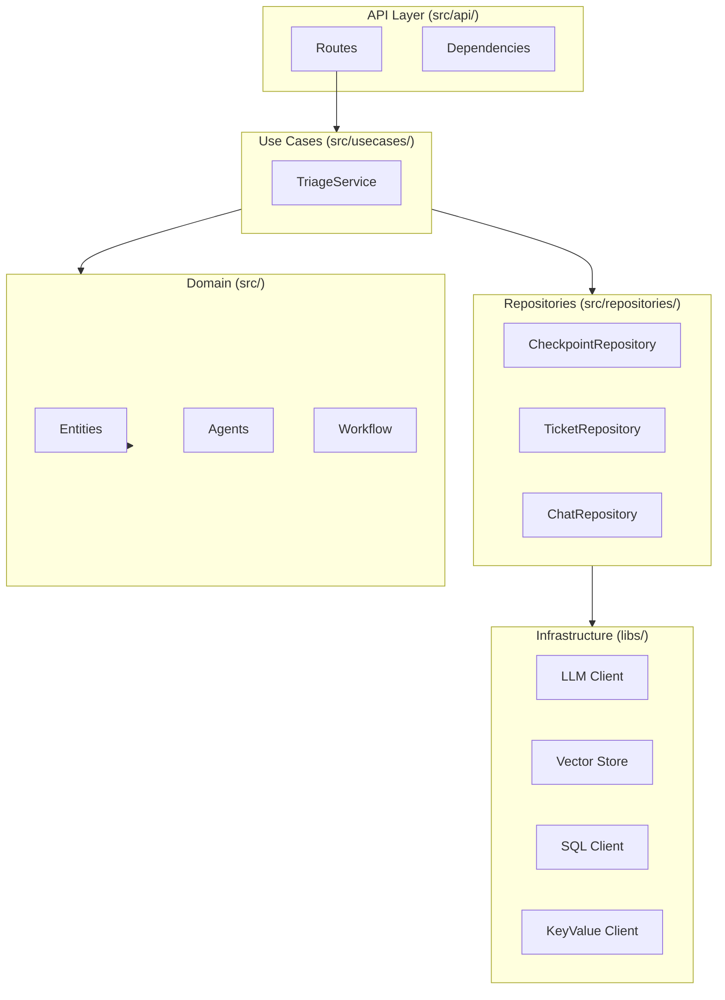
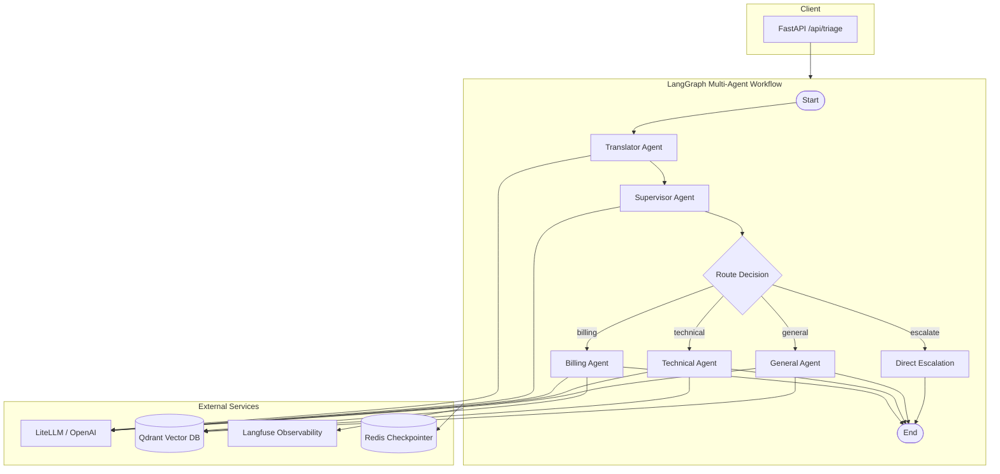
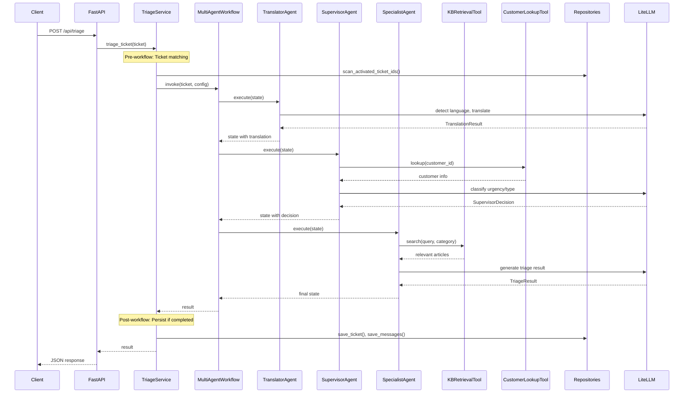
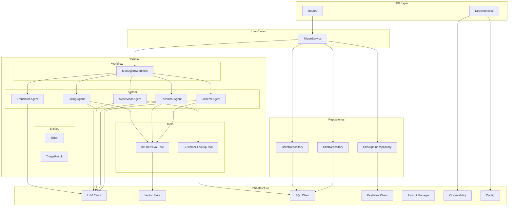

# Architecture

## Clean Architecture Layers



| Layer | Folder | Responsibility |
|-------|--------|---------------|
| API | `src/api/` | HTTP handlers, dependency injection |
| Use Cases | `src/usecases/` | Application business logic orchestration |
| Domain | `src/entities/`, `src/modules/` | Core business rules, agents, workflow |
| Repositories | `src/repositories/` | Abstract data persistence |
| Infrastructure | `libs/` | Database clients, external APIs |

## Project Structure

```
support-ticket-triage-agent/
├── main.py                      # Entry point (config injection)
├── configs/                     # YAML configuration files
│   ├── agents/
│   ├── litellm/
│   └── prompts/
├── libs/                        # Infrastructure layer
│   ├── database/
│   │   ├── keyvalue_db/         # Redis client
│   │   ├── tabular/sql/         # PostgreSQL client
│   │   └── vector/              # Qdrant client
│   ├── llm/
│   │   ├── client/              # LiteLLM client
│   │   ├── observability/       # Langfuse
│   │   └── prompt_manager/
│   └── logger/
├── src/
│   ├── entities/                # Domain models
│   ├── modules/                 # Domain logic
│   │   ├── agents/              # Agent implementations
│   │   └── graph/               # LangGraph workflow
│   ├── usecases/                # Use Cases (services)
│   │   └── triage/              # TriageService
│   ├── api/                     # API layer
│   │   ├── routes/
│   │   └── dependencies/
│   ├── repositories/            # Data access abstraction
│   │   ├── checkpoint/
│   │   ├── ticket/
│   │   └── chat/
│   └── configs/                 # Settings (Dynaconf)
└── docs/                        # Documentation
```

## System Architecture



## Component Flow



## Data Flow

```mermaid
flowchart LR
    subgraph Input
        Ticket[Ticket Model]
    end

    subgraph Translation
        Detect[Detect Language]
        Translate[Translate to English]
    end

    subgraph Classification
        Lookup[Customer Lookup]
        Classify[Classify Urgency/Type]
        Route[Route to Specialist]
    end

    subgraph Specialist
        Search[KB Search]
        Analyze[Domain Analysis]
        Recommend[Recommend Action]
    end

    subgraph Output
        Result[TriageResult Model]
    end

    Ticket --> Detect
    Detect --> Translate
    Translate --> Lookup
    Lookup --> Classify
    Classify --> Route
    Route --> Search
    Search --> Analyze
    Analyze --> Recommend
    Recommend --> Result
```



## Module Dependencies



## Agent Responsibilities

| Agent | Tools | Purpose |
|-------|-------|---------|
| TranslatorAgent | None | Language detection and translation |
| SupervisorAgent | customer_lookup | Classification and routing |
| BillingAgent | kb_search (billing) | Billing domain expertise |
| TechnicalAgent | kb_search (technical) | Technical domain expertise |
| GeneralAgent | kb_search (general) | General inquiry handling |

## Design Decisions

- **Config injection via main.py** - Configuration loaded once at startup
- **FastAPI app factory pattern** - `create_app(config)` receives config dict
- **Dynaconf for settings** - Environment-aware configuration
- **Provider pattern for libs** - Swappable implementations
- **Repository pattern** - Abstracts data access from business logic
- **Service layer** - Orchestrates pre/post workflow logic

## Key Files

| File | Purpose |
|------|---------|
| `main.py` | Entry point, config injection |
| `src/api/app.py` | FastAPI application factory |
| `src/api/dependencies/triage.py` | Service initialization |
| `src/usecases/triage/main.py` | TriageService |
| `src/modules/graph/workflow.py` | MultiAgentWorkflow |

## See Also

- [Agent Flow](agent-flow.md) - Detailed step-by-step execution flow
