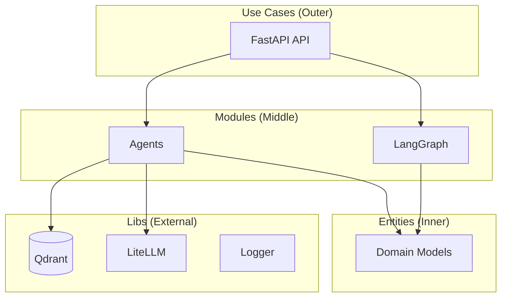

# Architecture

## Overview

Clean Architecture with 3 layers following the dependency rule (outer depends on inner).

## Layers

1. **Entities** (Inner) - Domain models, pure business logic
2. **Modules** (Middle) - Building blocks (agents, graph workflows)
3. **Use Cases** (Outer) - API entry points

## Diagram



## Project Structure

```
support-ticket-triage-agent/
├── main.py                      # Entry point (config injection)
├── configs/                     # YAML configuration files
│   ├── agents/
│   ├── litellm/
│   └── prompts/
├── libs/                        # Shared libraries
│   ├── database/qdrant/
│   ├── llm/litellm/
│   └── logger/
├── src/
│   ├── entities/                # Layer 1: Domain models
│   ├── modules/                 # Layer 2: Building blocks
│   │   ├── agents/
│   │   └── graph/
│   ├── usecases/                # Layer 3: API layer
│   │   └── api/
│   └── configs/                 # Settings (Dynaconf)
├── ingestor/                    # Data ingestion module
└── docs/                        # Documentation
```

## Design Decisions

- **Config injection via main.py** - Configuration loaded once at startup
- **FastAPI app factory pattern** - `create_app(config)` receives config dict
- **Dynaconf for settings** - Environment-aware configuration
- **Provider pattern for libs** - Swappable implementations

## Key Files

| File | Purpose |
|------|---------|
| `main.py` | Entry point, config injection |
| `src/usecases/api/app.py` | FastAPI application factory |
| `src/configs/settings.py` | Dynaconf settings |

## Why This Approach

- Clear separation of concerns
- Dependency rule: outer layers depend on inner layers
- Testable, maintainable code
- Easy to swap implementations

## Key Patterns

### Config Injection

Configuration loaded once at `main.py`, passed to components:

```python
# main.py
app = create_app(config=settings.as_dict())

# app.py
def create_app(config: dict) -> FastAPI:
    ...
```

### App Factory Pattern

FastAPI app created via factory function:

```python
def create_app(config: dict) -> FastAPI:
    app = FastAPI(title=config.get("APP_TITLE"))
    return app
```
