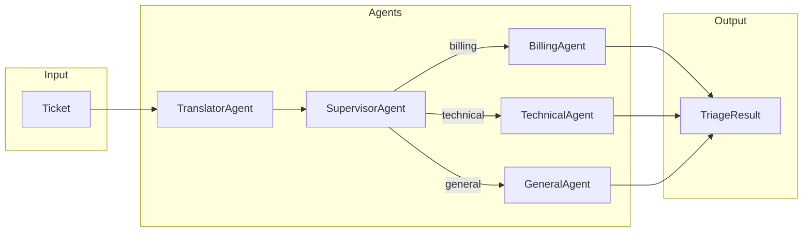

# Agents

Agent implementations for the support ticket triage system.

## Location

`src/modules/agents/`

## Folder Structure

```
src/modules/agents/
├── base.py                         # BaseAgent abstract class
├── specialists/                    # Specialist agents
│   ├── __init__.py
│   ├── base.py                     # SpecialistBaseAgent shared logic
│   ├── billing/
│   │   ├── __init__.py
│   │   └── main.py                 # BillingAgent
│   ├── technical/
│   │   ├── __init__.py
│   │   └── main.py                 # TechnicalAgent
│   └── general/
│       ├── __init__.py
│       └── main.py                 # GeneralAgent
├── supervisor/
│   ├── __init__.py
│   ├── main.py                     # SupervisorAgent
│   └── tools/
│       ├── __init__.py
│       ├── customer_lookup.py      # CustomerLookupTool
│       └── customer_ticket_history.py # CustomerTicketHistoryTool
├── translator/
│   ├── __init__.py
│   └── main.py                     # TranslatorAgent
├── ticket_matcher/
│   ├── __init__.py
│   ├── main.py                     # TicketMatcherAgent
│   └── tools/
│       ├── __init__.py
│       └── ticket_summarize.py     # TicketSummarizeTool
└── tools/                          # Shared tools
    ├── __init__.py
    └── kb_retrieval.py             # KBRetrievalTool (shared)
```

## Documentation

| Document | Description |
|----------|-------------|
| [base.md](base.md) | BaseAgent abstract base class |
| [specialists/base.md](specialists/base.md) | SpecialistBaseAgent - shared specialist logic |
| [specialists/billing/](specialists/billing/README.md) | BillingAgent - billing domain specialist |
| [specialists/technical/](specialists/technical/README.md) | TechnicalAgent - technical domain specialist |
| [specialists/general/](specialists/general/README.md) | GeneralAgent - general inquiries specialist |
| [supervisor/](supervisor/README.md) | SupervisorAgent - classification and routing |
| [translator/](translator/README.md) | TranslatorAgent - language detection and translation |
| [ticket_matcher/](ticket_matcher/README.md) | TicketMatcherAgent - matches messages to activated tickets |
| [tools/](tools/README.md) | Shared agent tools (KB retrieval) |

## Overview

Multi-agent supervisor architecture for ticket triage:



- **TranslatorAgent**: Detects language, translates non-English tickets
- **SupervisorAgent**: Classifies urgency/type, routes to specialist
- **SpecialistAgents**: Domain-specific triage (billing, technical, general)
- **TicketMatcherAgent**: Matches new messages to activated tickets (used by TriageService)
- **BaseAgent**: Abstract base class that all agents inherit from

> **Note**: Ticket matching and persistence are handled by `TriageService`, not agents.

## Usage

```python
from src.modules.agents.base import BaseAgent

class MyAgent(BaseAgent):
    def __init__(self):
        super().__init__(name="my_agent")

    def execute(self, state: dict) -> dict:
        # Process state
        return state
```

## Import Examples

```python
# Agents
from src.modules.agents.specialists.billing.main import BillingAgent
from src.modules.agents.supervisor.main import SupervisorAgent
from src.modules.agents.translator.main import TranslatorAgent

# Tools
from src.modules.agents.supervisor.tools.customer_lookup import CustomerLookupTool
from src.modules.agents.ticket_matcher.tools.ticket_summarize import TicketSummarizeTool
from src.modules.agents.specialists.tools.kb_retrieval import KBRetrievalTool  # Specialists
```

## See Also

- [Entities](../../entities/README.md)
- [Graph Workflow](../graph/README.md)
- [Agent Flow](../graph/agent-flow.md)
