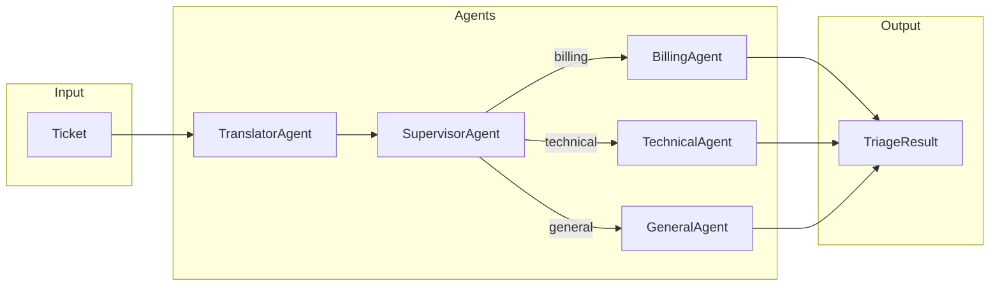

# Agents

Agent implementations for the support ticket triage system.

## Location

`src/modules/agents/`

## Documentation

| Document | Description |
|----------|-------------|
| [base.md](base.md) | BaseAgent abstract base class |
| [translator.md](translator.md) | TranslatorAgent - language detection and translation |
| [supervisor.md](supervisor.md) | SupervisorAgent - classification and routing |
| [specialist_base.md](specialist_base.md) | SpecialistBaseAgent - shared specialist logic |
| [billing.md](billing.md) | BillingAgent - billing domain specialist |
| [technical.md](technical.md) | TechnicalAgent - technical domain specialist |
| [general.md](general.md) | GeneralAgent - general inquiries specialist |
| [triage.md](triage.md) | TriageAgent (legacy single-agent) |
| [tools/](tools/README.md) | Agent tools (KB retrieval, customer lookup) |

## Overview

Multi-agent supervisor architecture for ticket triage:



- **TranslatorAgent**: Detects language, translates non-English tickets
- **SupervisorAgent**: Classifies urgency/type, routes to specialist
- **SpecialistAgents**: Domain-specific triage (billing, technical, general)
- **BaseAgent**: Abstract base class that all agents inherit from

## Usage

```python
from src.modules.agents.base import BaseAgent

class TriageAgent(BaseAgent):
    def __init__(self):
        super().__init__(name="triage")

    def execute(self, state: dict) -> dict:
        # Process state
        return state
```

## See Also

- [Entities](../../entities/README.md)
- [Architecture](../../../architecture/README.md)
