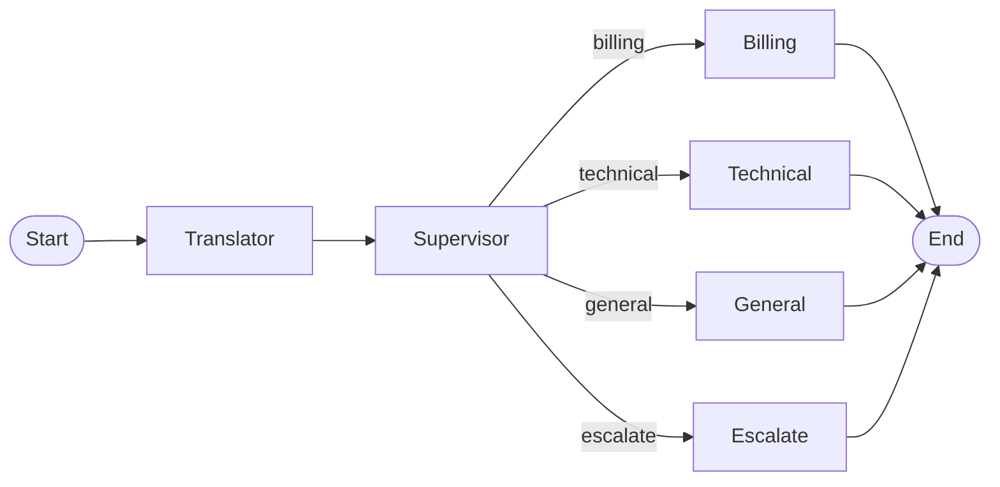

# Graph

LangGraph multi-agent workflow for ticket triage.

## Location

`src/modules/graph/`

## Documentation

| Document | Description |
|----------|-------------|
| [Agent Flow](../../../architecture/agent-flow.md) | Detailed step-by-step execution flow |
| [state.md](state.md) | AgentState, TranslationResult, SupervisorDecision |
| [workflow.md](workflow.md) | MultiAgentWorkflow class |

## Overview

The graph module orchestrates the multi-agent triage process using LangGraph:



- **AgentState**: TypedDict with translation, supervisor_decision, triage_result
- **MultiAgentWorkflow**: StateGraph with supervisor pattern and Redis checkpointing

> **Note**: Ticket persistence is handled by `TriageService` (post-workflow), not by the workflow itself.

## Usage

```python
from src.modules.graph.workflow import MultiAgentWorkflow
from src.modules.graph.state import create_initial_state

workflow = MultiAgentWorkflow(
    translator_agent=translator,
    supervisor_agent=supervisor,
    billing_agent=billing,
    technical_agent=technical,
    general_agent=general,
    observability=observability,
    checkpointer=checkpointer,
)

# Run workflow (called by TriageService)
result = workflow.invoke(ticket, config)
triage_result = result["triage_result"]
```

## See Also

- [Agents](../agents/README.md)
- [Entities](../../entities/README.md)
- [Multi-Agent Architecture](../../../decision/multi-agent-architecture.md)
