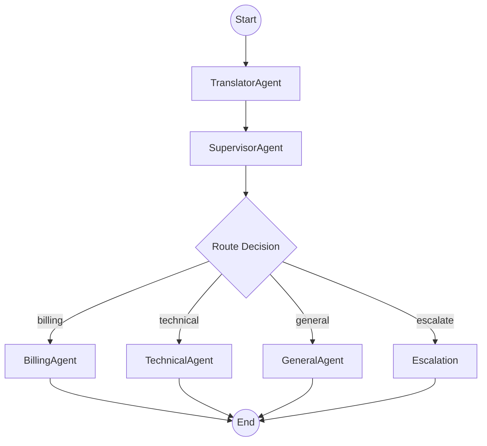

# MultiAgentWorkflow

LangGraph workflow for multi-agent ticket triage.

## Location

`src/modules/graph/workflow.py`

## Class

### `MultiAgentWorkflow`

Orchestrates the multi-agent triage process using a supervisor pattern.

**Constructor Parameters**:

| Parameter | Type | Description |
|-----------|------|-------------|
| `translator_agent` | BaseAgent | Language detection and translation |
| `supervisor_agent` | BaseAgent | Classification and routing |
| `billing_agent` | BaseAgent | Billing specialist |
| `technical_agent` | BaseAgent | Technical specialist |
| `general_agent` | BaseAgent | General specialist |
| `observability` | BaseObservability | Langfuse client for tracing |
| `checkpointer` | BaseCheckpointSaver | Redis checkpointer |

## Methods

### `invoke(ticket, config) -> AgentState`

Run the multi-agent triage workflow on a ticket.

**Parameters**:

| Parameter | Type | Description |
|-----------|------|-------------|
| `ticket` | Ticket | Support ticket to triage |
| `config` | Optional[dict] | LangGraph config |

**Returns**: Final AgentState with triage_result.

## Workflow Graph



## Agent Flow

1. **TranslatorAgent**: Detects language, translates non-English tickets
2. **SupervisorAgent**: Classifies urgency/type using customer_lookup tool
3. **Specialist Agent**: Domain-specific triage with kb_search tool
4. **Result**: TriageResult with recommended action

## Observability

Uses Langfuse for tracing. All interactions are grouped by `customer_id`:

| Langfuse Field | Value | Purpose |
|----------------|-------|---------|
| `session_id` | `customer_id` | Groups all customer interactions |
| `metadata.ticket_id` | `ticket_id` | Tracks individual ticket |
| `metadata.plan` | Customer plan | Customer context |
| `metadata.region` | Customer region | Customer context |

## Usage

```python
from src.modules.graph.workflow import MultiAgentWorkflow

workflow = MultiAgentWorkflow(
    translator_agent=translator,
    supervisor_agent=supervisor,
    billing_agent=billing,
    technical_agent=technical,
    general_agent=general,
    observability=observability,
    checkpointer=checkpointer,
)

result = workflow.invoke(ticket)
triage_result = result["triage_result"]
```

## Backwards Compatibility

`TriageWorkflow` is aliased to `MultiAgentWorkflow` for backwards compatibility.
