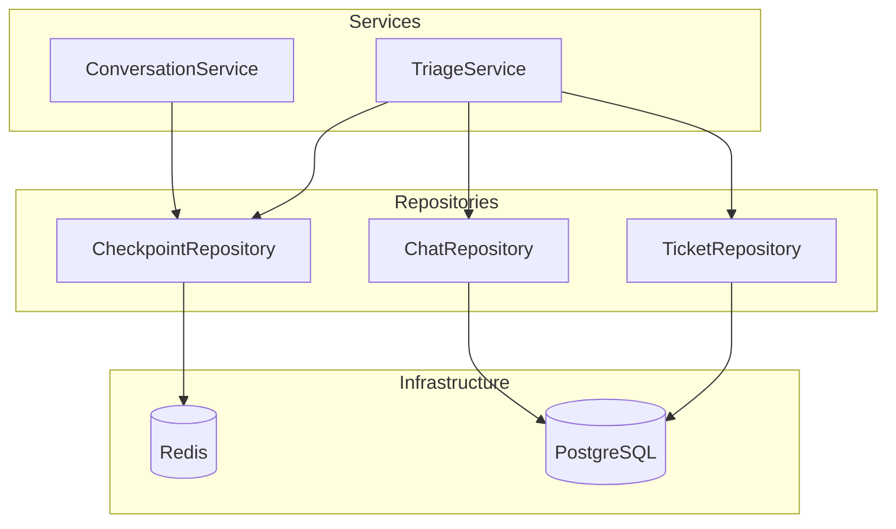

# Repositories

Data access layer for the support ticket triage system.

## Location

`src/repositories/`

## Folder Structure

```
src/repositories/
├── __init__.py
├── checkpoint/
│   ├── __init__.py
│   └── main.py                     # CheckpointRepository
├── ticket/
│   ├── __init__.py
│   └── main.py                     # TicketRepository
└── chat/
    ├── __init__.py
    └── main.py                     # ChatRepository
```

## Documentation

| Document | Description |
|----------|-------------|
| [checkpoint/README.md](checkpoint/README.md) | CheckpointRepository - LangGraph checkpoint operations |
| [ticket/README.md](ticket/README.md) | TicketRepository - Ticket SQL operations |
| [chat/README.md](chat/README.md) | ChatRepository - Chat message SQL operations |

## Overview

Repositories provide pure data access abstraction. They contain NO business logic - only database operations.



## Layer Rules

| DO | DO NOT |
|----|--------|
| Perform CRUD operations | Contain business logic |
| Abstract database access | Make business decisions |
| Return raw data | Validate business rules |

## Import Examples

```python
from src.repositories.checkpoint.main import CheckpointRepository
from src.repositories.ticket.main import TicketRepository
from src.repositories.chat.main import ChatRepository
```

## See Also

- [Services](../usecases/services/README.md)
- [Infrastructure (libs/database)](../../../libs/database/README.md)
